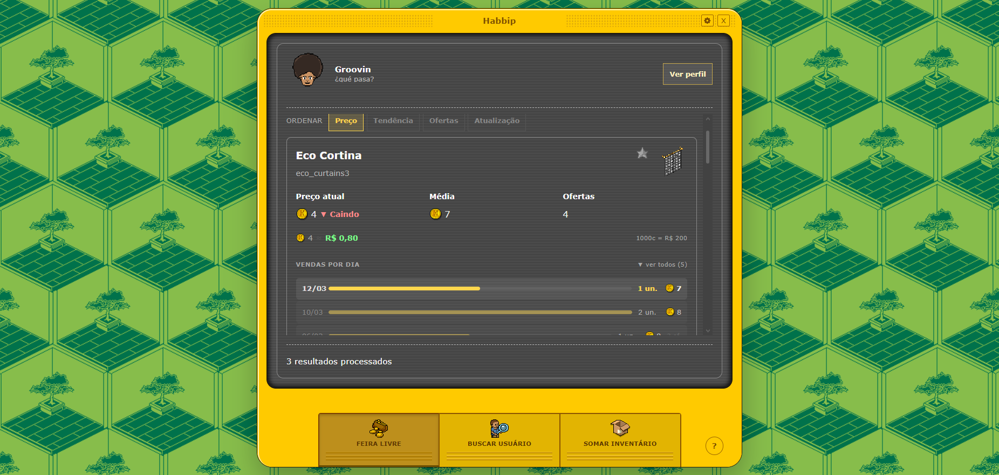
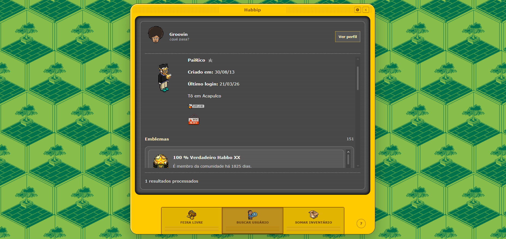
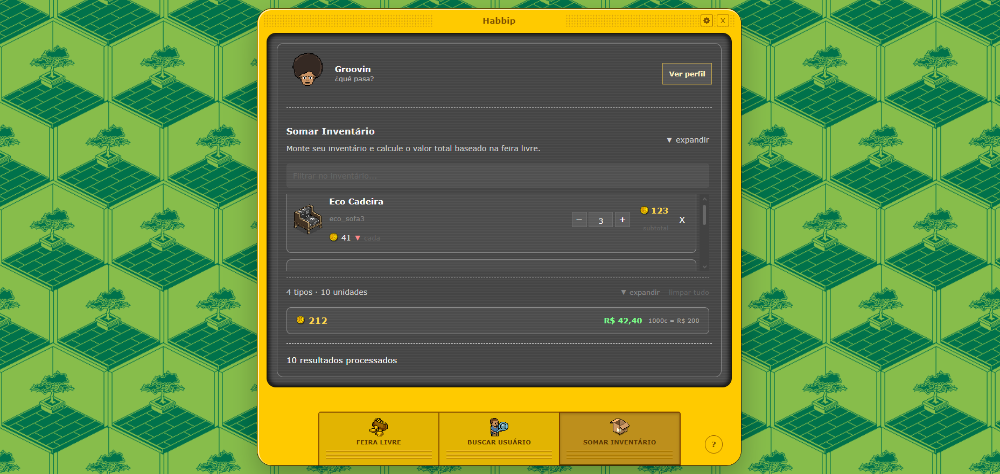

# Habbip

> Ferramenta feita para jogadores do Habbo Hotel — consulte preços da Feira Livre, pesquise perfis de usuários e gerencie seu inventário de mobis.

---

## Screenshots

<!-- Substitua os caminhos abaixo pelas imagens reais do projeto -->

---

## Funcionalidades

### 🛒 Feira Livre
- Pesquise mobis por nome ou classname
- Veja preço atual, média e quantidade de ofertas
- Acompanhe a tendência de preço (subindo, caindo ou estável)
- Histórico de vendas por dia com gráfico de linha interativo
- Conversor de créditos para reais com taxa personalizável
- Ordenação por preço, tendência, ofertas ou atualização
- Histórico de buscas recentes com favoritos

### 👤 Buscar Usuário
- Pesquise qualquer usuário do Habbo Hotel BR
- Veja perfil completo: emblemas, amigos, grupos e quartos
- Salve usuários como favoritos
- Histórico de buscas recentes

### 📦 Somar Inventário
- Monte seu inventário adicionando mobis pelo nome ou classname
- Controle a quantidade de cada item
- Cálculo automático do valor total baseado nos preços da Feira Livre
- Conversor de créditos para reais
- Filtro de busca dentro do inventário
- Inventário salvo por usuário logado
- Histórico de buscas com favoritos

### 👤 Login
- Entre com seu nick do Habbo para salvar seus dados
- Inventário, histórico e favoritos separados por usuário
- Opção de continuar como anônimo

---

## Aviso Legal

Este projeto não é afiliado, patrocinado, apoiado ou aprovado pela Sulake Oy ou suas afiliadas. Habbo é uma marca registrada da Sulake Oy.

---

## Autor

Desenvolvido por **[Groovin](https://www.habbo.com.br/profile/Groovin)** 🎮